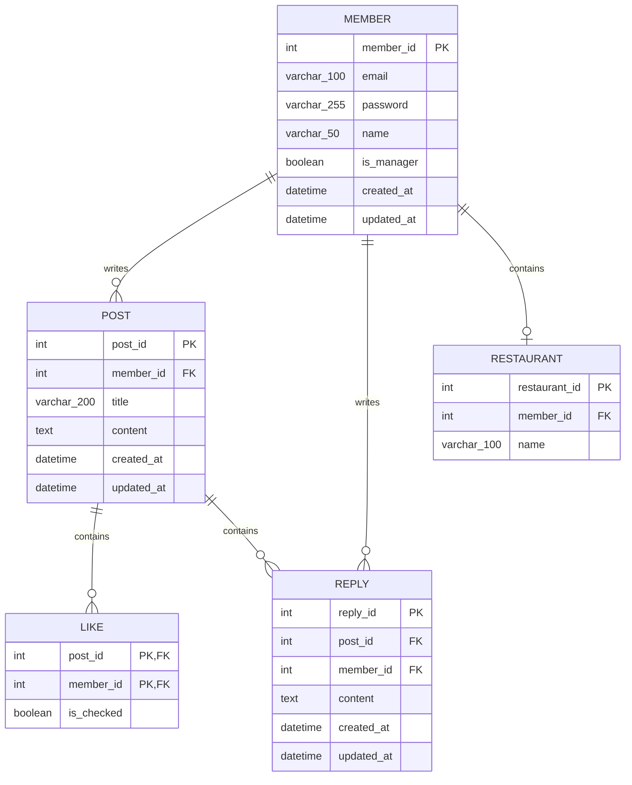

# 1. 데이터베이스 ERD 및 테이블 정의서

## 목차
- [1. 데이터베이스 ERD 및 테이블 정의서](#1-데이터베이스-erd-및-테이블-정의서)
- [1.1 Mermaid 기반 ERD 다이어그램](#11-mermaid-기반-erd-다이어그램)
- [1.2 테이블 상세 명세서](#12-테이블-상세-명세서)
- [1.3 테이블 생성 DDL 스크립트](#13-테이블-생성-ddl-스크립트)

---

## 1.1 Mermaid 기반 ERD 다이어그램



---

## 1.2 테이블 상세 명세서

### 1.2.1 member (회원 테이블)
- member_id: INT, PRIMARY KEY, AUTO_INCREMENT (회원 고유 식별자)
- email: VARCHAR(100), NOT NULL (이메일 아이디)
- password: VARCHAR(255), NOT NULL (비밀번호)
- name: VARCHAR(50), NOT NULL (회원 이름)
- is_manager: BOOLEAN, NOT NULL DEFAULT FALSE (0: 일반회원, 1: 식당관계자)
- created_at: DATETIME, DEFAULT CURRENT_TIMESTAMP (가입 일시)
- updated_at: DATETIME, DEFAULT CURRENT_TIMESTAMP ON UPDATE CURRENT_TIMESTAMP (정보 수정시 갱신)

### 1.2.2 restaurant (식당 테이블)
- id: INT, PRIMARY KEY, AUTO_INCREMENT (식당 고유 식별자)
- member_id: INT UNIQUE, FOREIGN KEY (식당 관계자와 식당 이름 연결)
- name: VARCHAR(100), NOT NULL (식당 이름)

### 1.2.3 post (게시글 테이블)
- post_id: INT, PRIMARY KEY, AUTO_INCREMENT (게시글 고유 식별자)
- member_id: INT, FOREIGN KEY (작성자 회원 식별자)
- title: VARCHAR(200), NOT NULL (게시글 제목)
- content: TEXT, NOT NULL (게시글 본문)
- view_count: INT, DEFAULT 0 (조회수)
- created_at: DATETIME, DEFAULT CURRENT_TIMESTAMP (작성 일시)
- updated_at: DATETIME, DEFAULT CURRENT_TIMESTAMP ON UPDATE CURRENT_TIMESTAMP (글 수정시 갱신)

### 1.2.4 like (좋아요 테이블)
- post_id: INT, PRIMARY KEY, FOREIGN KEY (대상 게시글 식별자)
- member_id: INT, PRIMARY KEY, FOREIGN KEY (좋아요 누른 회원 식별자)
- is_checked: BOOLEAN, NOT NULL DEFAULT FALSE (좋아요 여부)

### 1.2.5 reply (댓글 테이블)
- reply_id: INT, PRIMARY KEY, AUTO_INCREMENT (댓글 고유 식별자)
- post_id: INT, FOREIGN KEY (대상 게시글 식별자)
- member_id: INT, FOREIGN KEY (댓글 작성자 식별자)
- content: TEXT, NOT NULL (댓글 내용)
- created_at: DATETIME, DEFAULT CURRENT_TIMESTAMP (작성 일시)
- updated_at: DATETIME, DEFAULT CURRENT_TIMESTAMP ON UPDATE CURRENT_TIMESTAMP (댓글 수정시 갱신)

---

## 1.3 테이블 생성 DDL 스크립트

```sql
CREATE TABLE member (
    id INT AUTO_INCREMENT PRIMARY KEY,
    email VARCHAR(100) NOT NULL,
    password VARCHAR(255) NOT NULL,
    name VARCHAR(50) NOT NULL,
    phone VARCHAR(20),
    recommender_id INT,
    created_at DATETIME DEFAULT CURRENT_TIMESTAMP,
    CONSTRAINT fk_member_recommender FOREIGN KEY (recommender_id) REFERENCES member(id) ON DELETE SET NULL
);

CREATE TABLE post (
    id INT AUTO_INCREMENT PRIMARY KEY,
    member_id INT NULL,
    writer_name VARCHAR(50) NULL,
    password VARCHAR(255) NULL,
    title VARCHAR(200) NOT NULL,
    content TEXT NOT NULL,
    view_count INT NOT NULL DEFAULT 0,
    created_at DATETIME DEFAULT CURRENT_TIMESTAMP,
    CONSTRAINT fk_post_member FOREIGN KEY (member_id) REFERENCES member(id) ON DELETE SET NULL
);

CREATE TABLE reply (
    id INT AUTO_INCREMENT PRIMARY KEY,
    post_id INT NOT NULL,
    member_id INT NOT NULL,
    content TEXT NOT NULL,
    created_at DATETIME DEFAULT CURRENT_TIMESTAMP,
    CONSTRAINT fk_reply_post FOREIGN KEY (post_id) REFERENCES post(id) ON DELETE CASCADE,
    CONSTRAINT fk_reply_member FOREIGN KEY (member_id) REFERENCES member(id) ON DELETE CASCADE
);
```
