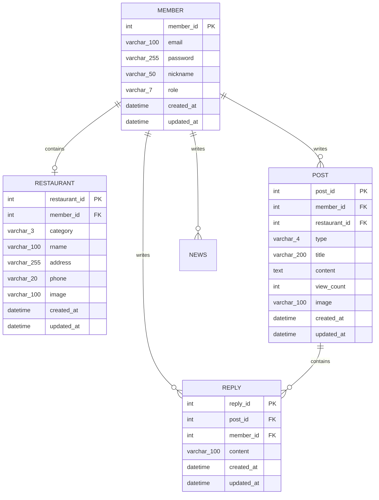

# 1. 데이터베이스 ERD 및 테이블 정의서

## 목차
- [1. 데이터베이스 ERD 및 테이블 정의서](#1-데이터베이스-erd-및-테이블-정의서)
- [1.1 Mermaid 기반 ERD 다이어그램](#11-mermaid-기반-erd-다이어그램)
- [1.2 테이블 상세 명세서](#12-테이블-상세-명세서)
- [1.3 테이블 생성 DDL 스크립트](#13-테이블-생성-ddl-스크립트)

---

## 1.1 Mermaid 기반 ERD 다이어그램



---

## 1.2 테이블 상세 명세서

### 1.2.1 member (회원 테이블)
- member_id: INT, PRIMARY KEY, AUTO_INCREMENT (회원 고유 식별자)
- email: VARCHAR(100), NOT NULL (이메일 아이디)
- password: VARCHAR(255), NOT NULL (비밀번호)
- nickname: VARCHAR(50), NOT NULL (회원 이름)
- role: VARCHAR(7), NOT NULL DEFAULT FALSE ('USER', 'MANAGER')
- created_at: DATETIME, DEFAULT CURRENT_TIMESTAMP (가입 일시)
- updated_at: DATETIME, DEFAULT CURRENT_TIMESTAMP ON UPDATE CURRENT_TIMESTAMP (정보 수정시 갱신)

### 1.2.2 restaurant (식당 테이블)
- restaurant_id: INT, PRIMARY KEY, AUTO_INCREMENT (식당 고유 식별자)
- member_id: INT UNIQUE, FOREIGN KEY (식당 관계자와 식당 이름 연결)
- category: VARCHAR(3), NOT NULL (음식 카테고리 - 'KOR', 'WST', 'CHN', 'JPN', 'ETC')
- rname: VARCHAR(50), NOT NULL (식당 이름)
- address: VARCHAR(100), NOT NULL (식당 주소)
- phone: VARCHAR(20), NOT NULL (식당 연락처)
- image: VARCHAR(100), NOT NULL (식당 사진 상대 경로)
- created_at: DATETIME, DEFAULT CURRENT_TIMESTAMP (가입 일시)
- updated_at: DATETIME, DEFAULT CURRENT_TIMESTAMP ON UPDATE CURRENT_TIMESTAMP (정보 수정시 갱신)

### 1.2.3 post (게시글 테이블)
- post_id: INT, PRIMARY KEY, AUTO_INCREMENT (게시글 고유 식별자)
- member_id: INT, FOREIGN KEY (작성자 회원 식별자)
- restaurant_id: INT, FOREIGN KEY (연결 식당 식별자)
- type: VARCHAR(4), NOT NULL ('POST', 'NEWS')
- title: VARCHAR(200), NOT NULL (게시글 제목)
- content: TEXT, NOT NULL (게시글 본문)
- view_count: INT, DEFAULT 0 (조회수)
- image: VARCHAR(100), NOT NULL (식당 사진 상대 경로)
- created_at: DATETIME, DEFAULT CURRENT_TIMESTAMP (작성 일시)
- updated_at: DATETIME, DEFAULT CURRENT_TIMESTAMP ON UPDATE CURRENT_TIMESTAMP (글 수정시 갱신)

### 1.2.4 reply (댓글 테이블)
- reply_id: INT, PRIMARY KEY, AUTO_INCREMENT (댓글 고유 식별자)
- post_id: INT, FOREIGN KEY (대상 게시글 식별자)
- member_id: INT, FOREIGN KEY (댓글 작성자 식별자)
- content: TEXT, NOT NULL (댓글 내용)
- created_at: DATETIME, DEFAULT CURRENT_TIMESTAMP (작성 일시)
- updated_at: DATETIME, DEFAULT CURRENT_TIMESTAMP ON UPDATE CURRENT_TIMESTAMP (댓글 수정시 갱신)

---

## 1.3 테이블 생성 DDL 스크립트

```sql
CREATE TABLE member (
                        member_id INT AUTO_INCREMENT PRIMARY KEY,
                        email VARCHAR(100) NOT NULL UNIQUE,
                        password VARCHAR(255) NOT NULL,
                        nickname VARCHAR(50) NOT NULL,
                        role VARCHAR(7) NOT NULL DEFAULT 'USER',
                        created_at DATETIME DEFAULT CURRENT_TIMESTAMP,
                        updated_at DATETIME DEFAULT CURRENT_TIMESTAMP ON UPDATE CURRENT_TIMESTAMP
);

CREATE TABLE restaurant (
                            restaurant_id INT AUTO_INCREMENT PRIMARY KEY,
                            member_id INT NOT NULL UNIQUE,
                            category VARCHAR(3) NOT NULL,
                            rname VARCHAR(50) NOT NULL,
                            address VARCHAR(100) NOT NULL,
                            phone VARCHAR(20) NOT NULL,
                            image VARCHAR(100) NOT NULL,
                            created_at DATETIME DEFAULT CURRENT_TIMESTAMP,
                            updated_at DATETIME DEFAULT CURRENT_TIMESTAMP ON UPDATE CURRENT_TIMESTAMP,
                            CONSTRAINT fk_restaurant_member FOREIGN KEY (member_id) REFERENCES member(member_id) ON DELETE CASCADE
);

CREATE TABLE post (
                      post_id INT AUTO_INCREMENT PRIMARY KEY,
                      member_id INT NOT NULL,
                      restaurant_id INT NOT NULL,
                      type VARCHAR(4) NOT NULL,
                      title VARCHAR(200) NOT NULL,
                      content TEXT NOT NULL,
                      view_count INT NOT NULL DEFAULT 0,
                      image VARCHAR(100) NOT NULL,
                      created_at DATETIME DEFAULT CURRENT_TIMESTAMP,
                      updated_at DATETIME DEFAULT CURRENT_TIMESTAMP ON UPDATE CURRENT_TIMESTAMP,
                      CONSTRAINT fk_post_member FOREIGN KEY (member_id) REFERENCES member(member_id) ON DELETE CASCADE,
                      CONSTRAINT fk_post_restaurant FOREIGN KEY (restaurant_id) REFERENCES restaurant(restaurant_id) ON DELETE CASCADE
);

CREATE TABLE reply (
                       reply_id INT AUTO_INCREMENT PRIMARY KEY,
                       post_id INT NOT NULL,
                       member_id INT NOT NULL,
                       content TEXT NOT NULL,
                       created_at DATETIME DEFAULT CURRENT_TIMESTAMP,
                       updated_at DATETIME DEFAULT CURRENT_TIMESTAMP ON UPDATE CURRENT_TIMESTAMP,
                       CONSTRAINT fk_reply_post FOREIGN KEY (post_id) REFERENCES post(post_id) ON DELETE CASCADE,
                       CONSTRAINT fk_reply_member FOREIGN KEY (member_id) REFERENCES member(member_id) ON DELETE CASCADE
);
```
