# 화면 설계서 (UI Wireframe)

## **목차**
- [1. 서비스 화면 구성 개요](#1-서비스-화면-구성-개요)
- [2. 주요 화면별 명세](#2-주요-화면별-명세)
- [3. 전체 화면 와이어프레임 배치도](#3-전체-화면-와이어프레임-배치도)

---

## **1. 서비스 화면 구성 개요**

### **1.1 주요 화면 목록**

- 메인 페이지 / 맛집 리뷰 (GET `/posts`)
- 맛집 리뷰 상세 조회 (GET `/posts/{postId}`)
- 맛집 리뷰 작성 (GET `/posts/write`)
- 맛집 리뷰 수정 (GET `/posts/edit`)
- 메인 페이지 / 맛집 소식 (GET `/news`)
- 맛집 소식 상세 조회 (GET `/news/{newsId}`)
- 맛집 소식 작성 (GET `/news/write`)
- 맛집 소식 수정 (GET `/news/edit`)
- 마이페이지 조회 - 일반 사용자 (GET `/mypage`)
- 마이페이지 조회 - 맛집 운영자 (GET `/mypage/restaurant`)
- 맛집 정보 수정 (GET `/mypage/restaurant/edit`)
- 로그인 (GET `/member/login`)
- 비밀번호 재설정 (GET `/member/password/reset`)
- 회원가입 (GET `/member/signup`)
- 회원가입-식당정보 등록 (GET `/member/signup/restaurant`)

---

## **2. 주요 화면별 명세**

### **2.1 맛집 리뷰 목록 화면 (GET `/posts`)**

[맛집 리뷰 목록]

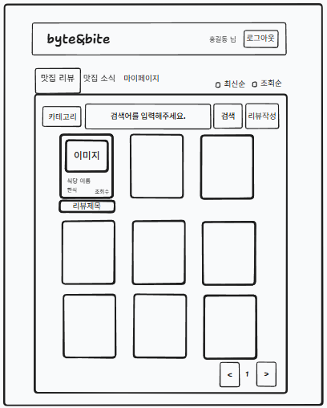&nbsp;&nbsp;&nbsp;&nbsp;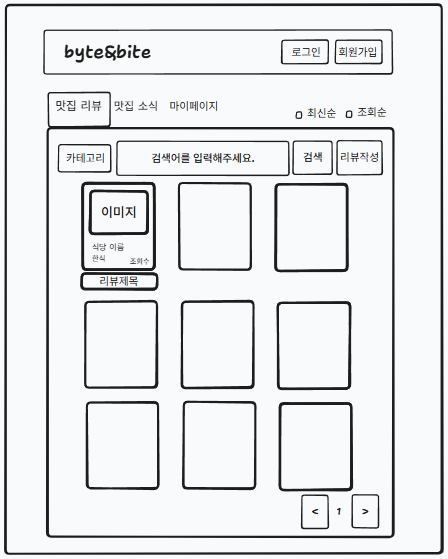

- 출력 데이터 항목 (Output Data):
    - GNB(Global Navigation Bar) 영역 : 서비스 타이틀, 로그아웃, 맛집리뷰, 맛집소식, 마이페이지
    - 상단 영역: 카테고리 및 제목 검색어 입력, 리뷰작성
    - 목록 테이블: 식당명, 카테고리, 리뷰제목, 이미지url
    - 하단 영역: 페이지네이션(현재 페이지 및 이동 컨트롤러)
- 화면 제어 및 권한 규칙 (Behavior Rules):
    - 서비스 타이틀 클릭 시 맛집 리뷰 목록 화면으로 이동
    - 맛집 소식 버튼 클릭 시 맛집 소식 목록 화면으로 이동
    - 마이페이지 버튼 클릭 시 마이페이지 화면으로 이동
    - 최신순, 조회순 라디오 버튼 클릭 시 해당 조건 맛집 리뷰 목록 조회
    - 카테고리를 선택하여 해당 조건 맛집 리뷰 목록 조회
    - 제목 검색어 입력 시 해당 검색어가 포함된 맛집 리뷰 목록 조회
    - 리뷰 작성 버튼 클릭 시 맛집 리뷰 작성 화면으로 이동
    - 맛집 리뷰 카드 클릭 시 해당 맛집 리뷰 상세 화면으로 이동
    - 비로그인 상태
        - 맛집 리뷰 목록 조회 가능
        - 맛집 리뷰 카드 클릭 시 해당 맛집 리뷰 상세 화면으로 이동
        - 리뷰작성 및 마이페이지 접근 시 HttpSession 검증 후 로그인 페이지 이동

### 2.2 맛집 리뷰 상세 화면 (GET **`/posts/{postId}`**

[맛집 리뷰 상세]

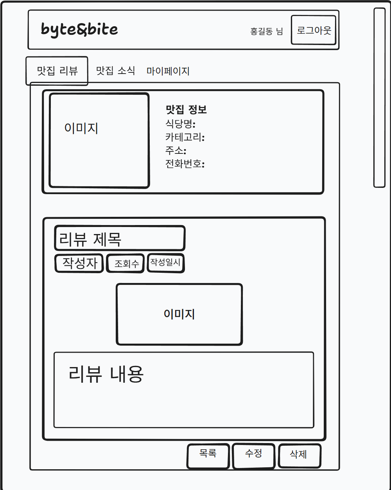&nbsp;&nbsp;&nbsp;&nbsp;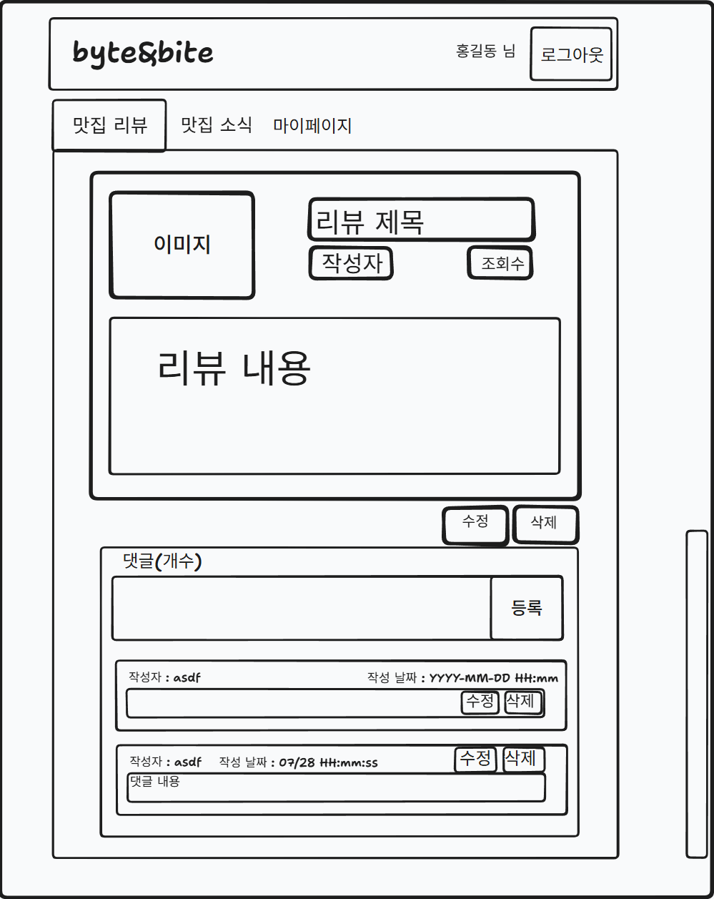

- 입력 데이터 및 검증 규칙 (Input Data & Validation):
    - 댓글 :  공백 제출 제한, 최대 100자 이하
- 출력 데이터 항목 (Output Data):
    - 상단 영역: 식당 대표 이미지, 맛집 정보(식당명, 카테고리, 주소, 전화번호)
    - 본문 영역: 리뷰 이미지, 리뷰 제목, 작성자, 작성일시, 조회수, 리뷰 본문 텍스트 콘텐츠
    - 댓글 영역: 댓글 작성자, 작성일시, 댓글 내용 목록 및 댓글 작성 폼
- 화면 제어 및 권한 규칙 (Behavior Rules):
    - 게시글 작성자 본인 인증 시에만 수정 및 삭제 버튼 노출
    - 댓글 작성자 본인 인증 시에만 댓글 수정 및 삭제 버튼 노출
    - 상단 맛집 리뷰 버튼 클릭 시 리뷰 목록 화면으로 이동
    - 비로그인 상태
        - 맛집 리뷰 상세 조회
        - 마이페이지 및 댓글 작성 시 HttpSession 검증 후 로그인 페이지 이동

### 2.3 맛집 리뷰 작성 화면 (GET `/posts/write`)

[맛집 리뷰 작성]

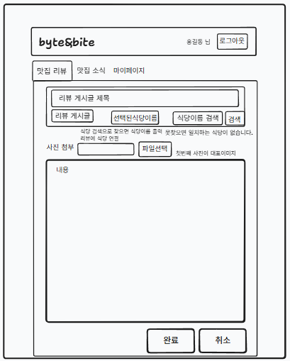

- 입력 데이터 및 검증 규칙 (Input Data & Validation):
    - 제목: 필수 입력 항목, 공백 제출 제한, 최대 50자 이하
    - 본문: 필수 입력 항목, 공백 제출 제한, 최대 1000자 이하
    - 이미지: 필수 첨부 항목
    - 식당 선택: 필수 선택 항목, 시스템에 등록된 식당만 검색 및 선택 가능하며, 선택한 식당 정보와 리뷰를 연결하여 저장
- 화면 제어 및 권한 규칙 (Behavior Rules):
    - 취소 버튼 클릭 시 이전 맛집 리뷰 목록 화면으로 이동
    - 완료 버튼 제출 시 유효성 검증 후 리뷰 등록 처리

### 2.4 맛집 리뷰 수정 화면 (GET `/posts/edit`)

[맛집 리뷰 수정]

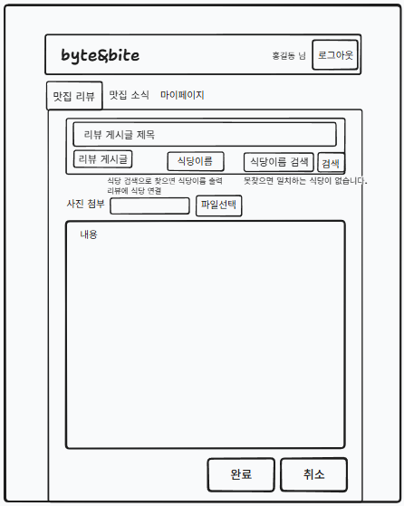

- 입력 데이터 및 검증 규칙 (Input Data & Validation):
    - 제목: 필수 입력 항목, 공백 제출 제한, 최대 50자 이하
    - 본문: 필수 입력 항목, 공백 제출 제한, 최대 1000자 이하
    - 이미지: 필수 첨부 항목
    - 식당 선택: 필수 선택 항목, 시스템에 등록된 식당만 검색 및 선택 가능하며, 선택한 식당 정보와 리뷰를 연결하여 저장
- 화면 제어 및 권한 규칙 (Behavior Rules):
    - 취소 버튼 클릭 시 이전 맛집 리뷰 목록 화면으로 이동
    - 완료 버튼 제출 시 유효성 검증 후 리뷰 등록 처리

### 2.5 맛집 소식 목록 화면 (GET `/news`)

[맛집 소식 목록]

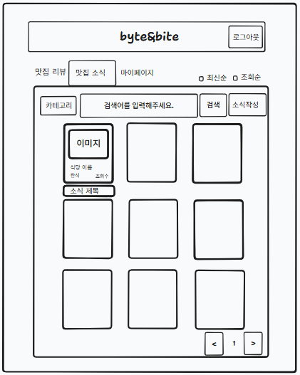

- 출력 데이터 항목 (Output Data):
    - GNB(Global Navigation Bar) 영역 : 서비스 타이틀, 로그아웃, 맛집리뷰, 맛집소식, 마이페이지
    - 상단 영역: 카테고리 및 제목 검색, 소식 작성
    - 목록 테이블: 식당명, 카테고리, 조회수, 소식 제목, 이미지url
    - 하단 영역: 페이지네이션(현재 페이지 및 이동 컨트롤러)
- 화면 제어 및 권한 규칙 (Behavior Rules):
    - 서비스 타이틀 클릭 시 맛집 리뷰 목록 화면으로 이동
    - 맛집 리뷰 버튼 클릭 시 맛집 리뷰 목록 화면으로 이동
    - 마이페이지 버튼 클릭 시 마이페이지 화면으로 이동
    - 최신순, 조회순 라디오 버튼 클릭 시 해당 조건 맛집 리뷰 목록 조회
    - 카테고리를 선택하여 해당 조건 맛집 리뷰 목록 조회
    - 제목 검색어 입력 시 해당 검색어가 포함된 맛집 리뷰 목록 조회
    - 소식 작성 버튼 클릭 시 맛집 리뷰 작성 화면으로 이동
    - 맛집 소식 카드 클릭 시 해당 맛집 소식 상세 화면으로 이동
    - 비로그인 상태
        - 맛집 소식 목록 조회
        - 맛집 소식 카드 클릭 시 해당 맛집 리뷰 상세 화면으로 이동
        - 소식 작성 및 마이페이지 접근 시 HttpSession 검증 후 로그인 페이지 이동

### 2.6 맛집 소식 상세 화면 (GET `/news/{newsId}`)

[맛집 소식 상세]

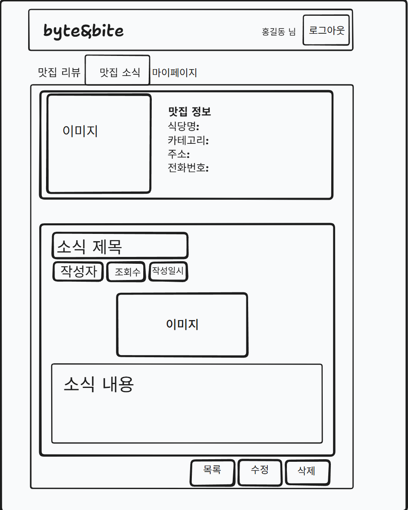

- 출력 데이터 항목 (Output Data):
    - 상단 영역: 식당 대표 이미지, 맛집 정보(식당명, 카테고리, 주소, 전화번호)
    - 본문 영역: 소식 이미지, 소식 제목, 작성일시, 조회수, 소식 본문 텍스트 콘텐츠
- 화면 제어 및 권한 규칙 (Behavior Rules):
    - 맛집 운영자 본인 인증 시에만 수정 및 삭제 버튼 노출
    - 상단 맛집 소식 버튼 클릭 시 맛집 소식 목록 화면으로 이동
    - 비로그인 상태
        - 맛집 소식 상세 조회
        - 마이페이지 접근 시 HttpSession 검증 후 로그인 페이지 이동

### 2.7 맛집 소식 작성 화면 (GET `/news/write`)

[맛집 소식 작성]

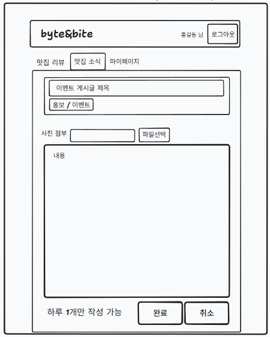

출력 데이터 항목 (Output Data): 

- 입력 데이터 및 검증 규칙 (Input Data & Validation):
    - 제목: 필수 입력 항목, 공백 제출 제한, 최대 50자 이하
    - 본문: 필수 입력 항목, 공백 제출 제한, 최대 1000자 이하
    - 이미지: 필수 첨부 항목
- 화면 제어 및 권한 규칙 (Behavior Rules):
    - 취소 버튼 클릭 시 이전 맛집 소식 목록 화면으로 이동
    - 완료 버튼 제출 시 유효성 검증 후 소식 등록 처리

### 2.8 맛집 소식 수정 화면 (GET `/news/edit`)

[맛집 소식 수정]

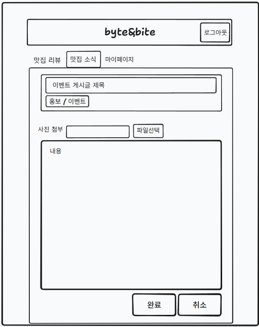

- 입력 데이터 및 검증 규칙 (Input Data & Validation):
    - 제목: 필수 입력 항목, 공백 제출 제한, 최대 50자 이하
    - 본문: 필수 입력 항목, 공백 제출 제한, 최대 1000자 이하
    - 이미지: 필수 첨부 항목
- 화면 제어 및 권한 규칙 (Behavior Rules):
    - 취소 버튼 클릭 시 이전 맛집 소식 목록 화면으로 이동
    - 완료 버튼 제출 시 유효성 검증 후 소식 수정 처리

### 2.9 마이페이지 화면 - 일반 사용자 (GET `/mypage`)

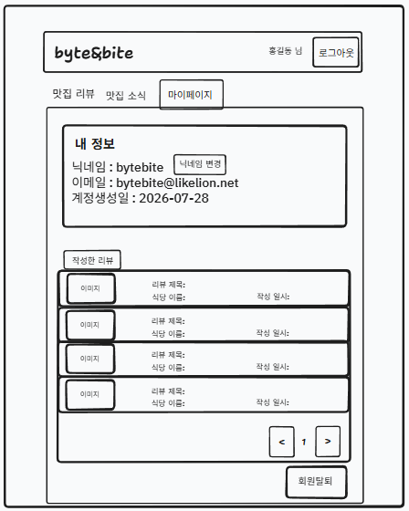&nbsp;&nbsp;&nbsp;&nbsp;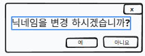

- 출력 데이터 항목 (Output Data):
    - 상단 영역: 내 정보(닉네임, 이메일, 계정 생성일)
    - 본문 영역: 리뷰 이미지, 리뷰 제목, 식당 이름, 작성일시
- 입력 데이터 및 검증 규칙 (Input Data & Validation):
    - 닉네임 : 공백제출 제한, 최대 10자 이하
- 화면 제어 및 권한 규칙 (Behavior Rules):
    - 닉네임 변경 버튼 클릭 시 닉네임 변경 창
    - 회원탈퇴 버튼 클릭 시 회원 탈퇴 처리

### 2.10 마이페이지 화면 - 맛집 운영자 (GET `/mypage/restaurant`)

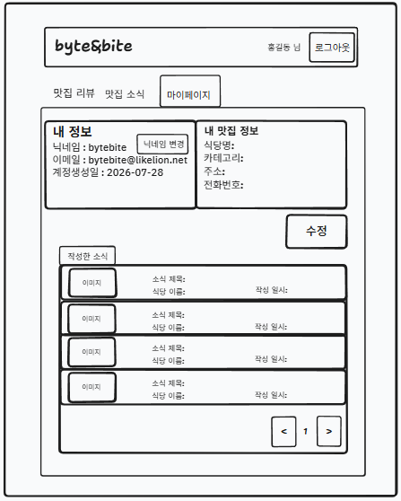

- 출력 데이터 항목 (Output Data):
    - 상단 영역: 내 정보(닉네임, 이메일, 계정 생성일), 맛집 정보(식당명, 카테고리, 주소, 전화번호)
    - 본문 영역: 소식 이미지, 소식 제목, 식당 이름, 작성일시
- 입력 데이터 및 검증 규칙 (Input Data & Validation):
    - 닉네임 : 공백제출 제한, 최대 10자 이하
- 화면 제어 및 권한 규칙 (Behavior Rules):
    - 닉네임 변경 버튼 클릭 시 닉네임 변경 창
    - 맛집 정보 수정 버튼 클릭 시 맛집 정보 수정 화면으로 이동

### 2.11 맛집 정보 수정 화면 (GET `/mypage/restaurant/edit`)

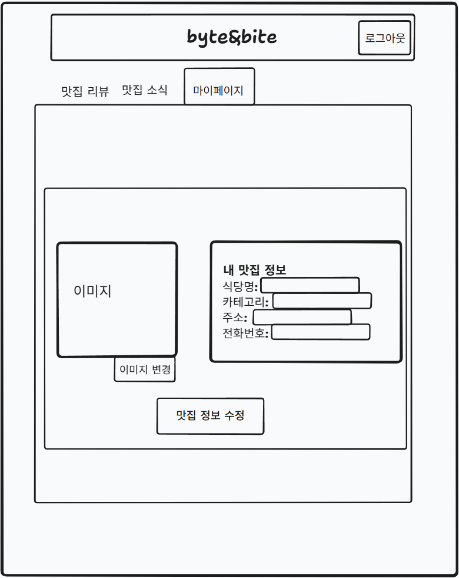

- 출력 데이터 항목 (Output Data):
    - 등록되어있는 식당명, 카테고리, 주소, 전화번호, 이미지
- 입력 데이터 및 검증 규칙 (Input Data & Validation):
    - 식당명 : 필수 입력 항목, 공백 제출 제한, 최대 10자 이하
    - 주소: 필수 입력 항목, 공백 제출 제한, 최대 100자 이하
    - 전화번호: 필수 입력 항목, 공백 제출 제한, 최대 20자 이하
    - 이미지: 필수 첨부 항목
- 화면 제어 및 권한 규칙 (Behavior Rules):
    - 맛집 정보 수정 버튼 클릭 시 맛집 정소 수정 처리
    - 수정 처리 후 마이페이지 화면 - 맛집 운영자로 이동

### 2.12 로그인 (GET `/member/login`)

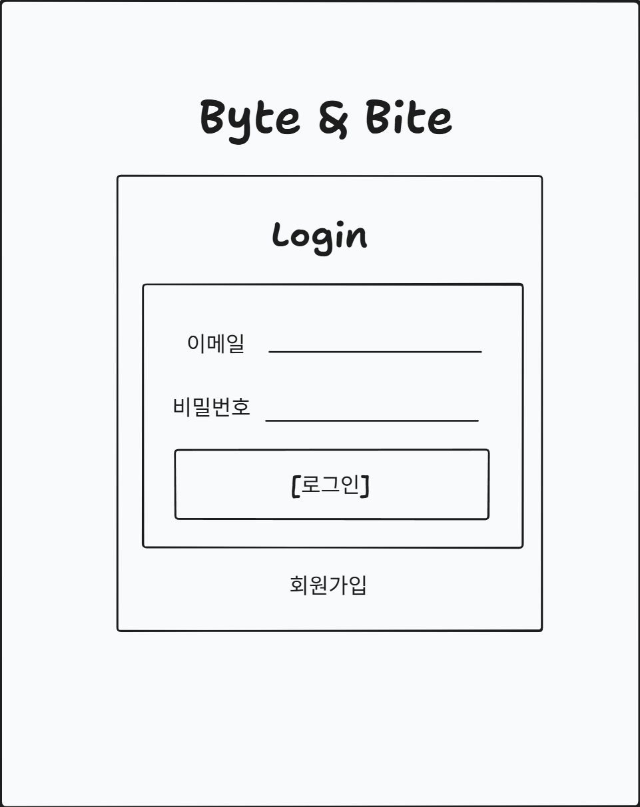

- 입력 데이터 및 검증 규칙 (Input Data & Validation):
    - 이메일 : 필수 입력 항목, 공백 제출 제한, 최대 50자 이하
    - 비밀번호 : 필수 입력 항목, 공백 제출 제한, 최소 8자 ~ 최대 20자 이하
- 화면 제어 및 권한 규칙 (Behavior Rules):
    - 이메일 @~~~ 미입력 시 경고 창 출력
    - 비밀번호 미입력 시 경고 창 출력

### 2.13 회원가입 화면 (GET `/member/signup`)

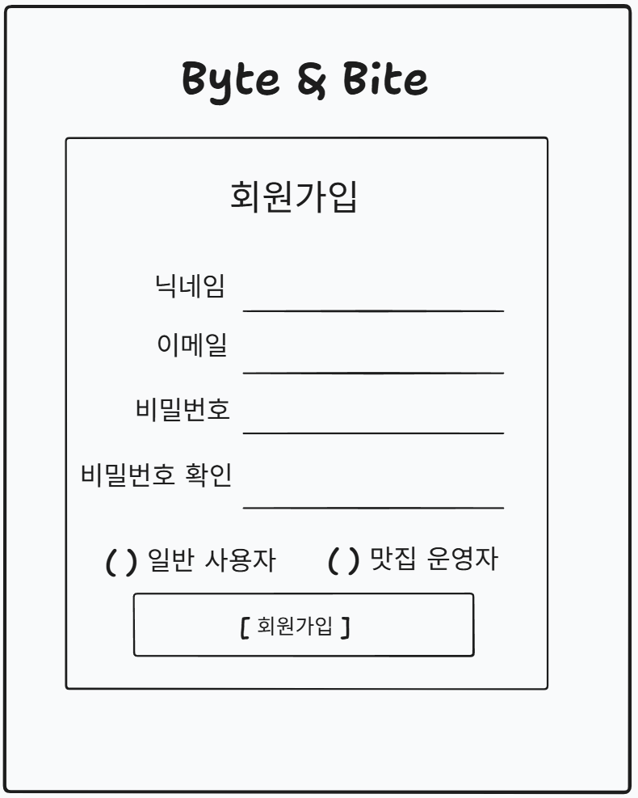

- 입력 데이터 및 검증 규칙 (Input Data & Validation):
    - 닉네임 : 필수 입력 항목, 공백 제출 제한, 최대 20자 이하
    - 이메일 : 필수 입력 항목, 공백 제출 제한, 최대 50자 이하
    - 비밀번호 : 필수 입력 항목, 공백 제출 제한, 최소 8자 ~ 최대 20자 이하
    - 비밀번호 확인 : 필수 입력 항목, 공백 제출 제한, 입력한 비밀번호와 똑같이 입력 필수
    - 사용자 체크박스 : 기본 값은 일반사용자, 맛집운영자는 맛집운영자로 체크
- 화면 제어 및 권한 규칙 (Behavior Rules):
    - 회원 가입 버튼 클릭 시 메인 페이지로 이동

### 2.14 식당정보 등록 화면 (GET `/member/signup/restaurant`)

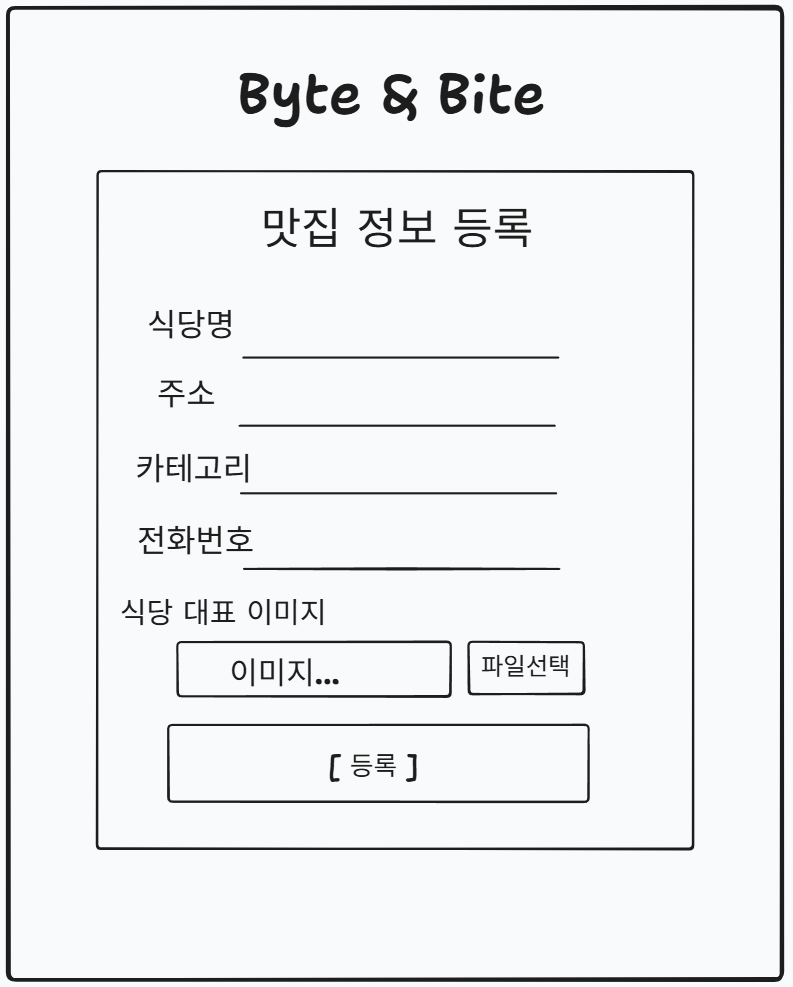

- 입력 데이터 및 검증 규칙 (Input Data & Validation):
    - 식당명 : 필수 입력 항목, 공백 제출 제한, 최대 50자 이하
    - 주소 : 필수 입력 항목, 공백 제출 제한, 최대 100자 이하
    - 전화번호 : 필수 입력 항목, 공백 제출 제한, 최대 20자 이하
    - 이미지 : 필수 입력 항목
- 화면 제어 및 권한 규칙 (Behavior Rules):
    - 등록 버튼 클릭 시 메인 페이지로 이동

## 3. 전체 화면 와이어프레임 배치도
- [와이어프레임 통합 파일 링크](https://www.tldraw.com/f/HlArDAOJNpK07U8u8NyEG?d=v-8605.-2086.8122.4256.page)
